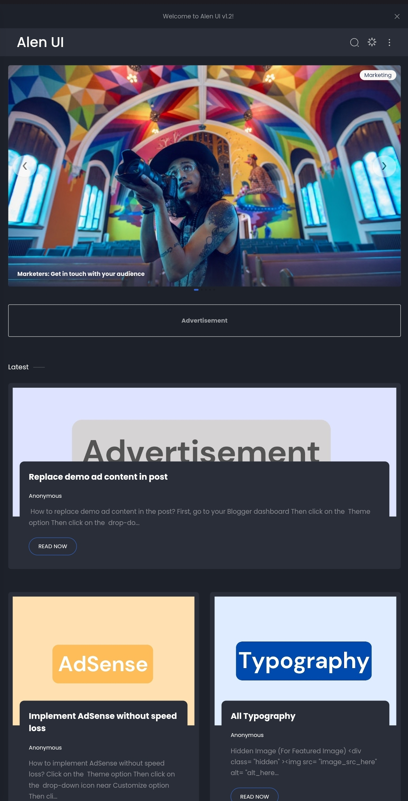

# Alen UI ⚡ – The Next-Gen Blogger Template for Speed & SEO

A **lightweight**, **fast-loading**, and **SEO-optimized** Blogger template designed for performance and modern web standards.

## 🚀 Features

- **No jQuery** – Improved performance by eliminating jQuery dependency.
- **Fast Loading** – Optimized for speed and efficiency.
- **Bootstrap Grid Only** – Clean and responsive layout.
- **SEO Optimized** – Enhanced for better search engine ranking.
- **Rich Results Support** – Structured data for improved visibility.
- **New Random Post Slider** – Replaces the traditional image slider.
- **Modern Border Design** – Fresh and appealing UI enhancements.

## 📷 Preview

## 📌 Installation & Documentation

Follow the [official documentation](https://alen-ui.blogspot.com/search/label/Docs) for step-by-step guidance on installation and customization.

## 💡 Why Choose Alen UI?

- 🚀 **Blazing Fast** – Loads quickly for better user experience and SEO.
- 🎨 **Minimal & Clean UI** – Aesthetic and easy-to-use design.
- 📱 **Fully Responsive** – Adapts perfectly to all screen sizes.
- 🛠️ **Customizable** – Easily tweak styles and settings.

## 📜 License

This project is licensed under the **MIT License** – you are free to use, modify, and distribute it with proper attribution.

## 📬 Contact & Support

For any queries or support, visit the [Docs](https://alen-ui.blogspot.com/search/label/docs), leave a comment on the demo site, or email **contact@incrediblegad.in**.

## ☕ Support the Project

If you like this template, consider buying me a coffee:

---

⭐ **Star this repo if you find it useful!**
